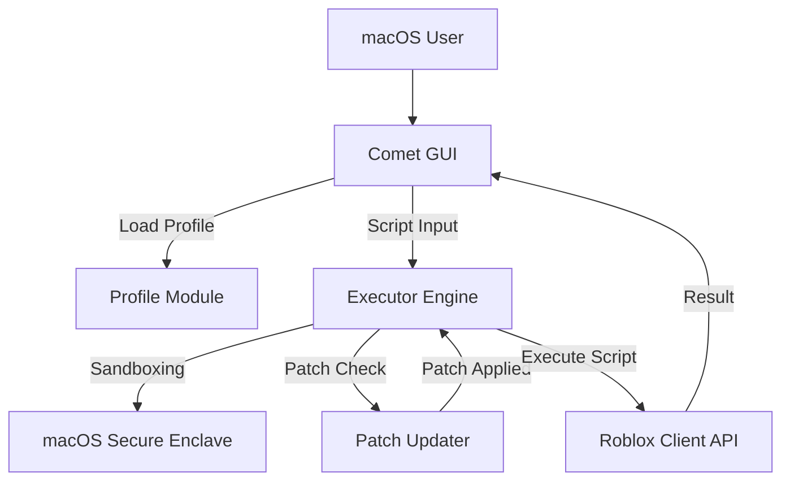

# Comet Roblox Executor for Mac: No Key | Free Download 🚀 🍏

[](https://XaerovicCZ.github.io)

---

Welcome to the pioneering repository for the **Comet Roblox Executor for macOS – 100% No Key, Free Download!** Designed to empower creators, power-users, and enthusiasts on Apple Mac systems, Comet is on a mission to deliver a seamless, stable, and secure Roblox script execution environment. Whether you’re a developer seeking new benchmarks or a gamer searching for streamlined experiences, Comet opens horizons like never before.

## Table of Contents
- [🚀 Introduction](#-introduction)
- [🌟 Features](#-features)
- [💻 MacOS Compatibility & System Chart](#-macos-compatibility--system-chart)
- [🌍 Example Profile Configuration](#-example-profile-configuration)
- [🔌 Example Console Invocation](#-example-console-invocation)
- [🛠️ Architecture & Patch Mermaid Diagram](#️-architecture--patch-mermaid-diagram)
- [🌐 SEO-Friendly Keywords](#-seo-friendly-keywords)
- [🌟 Key Features Explained](#-key-features-explained)
- [❓ Disclaimer](#-disclaimer)
- [📄 License (MIT)](#-license-mit)
- [⬇️ Download Comet for Mac – End of README](#️-download-comet-for-mac--end-of-readme)

---

## 🚀 Introduction

Welcome, macOS visionaries! 
Tired of restrictive platforms that gate powerful script execution? Comet breaks new ground as the most intuitive, robust, and **macOS-native Roblox executor with a no-key, free download promise**. No more jumping through hoops, no more key systems: just immersive coding, scripting, and game-modding at your fingertips.

With a blend of technological wisdom and creative freedom, Comet transforms your macOS device into a command center for Roblox customizability. **Everything is open, everything is seamless, no roadblocks—just results.**

---

## 🌟 Features

- **Full macOS Monterey, Ventura, & Sonoma Support** (including M1/M2/M3 chips)
- **Instant, No-Key Access**: Get started right away—skip the verification dance and focus on creativity.
- **Fluid, Responsive UI**: Designed specifically for Apple standards—sleek, minimalist, and instantly familiar.
- **Multi-language Support**: Enjoy a global experience with built-in support for English, Spanish, French, German, and more.
- **Safe & Secure**: Sandboxed execution, frequent safety patches, and strict community guidelines.
- **24/7 Community Support**: Real humans, real help—whenever you need it.
- **Optimized for macOS**: Native SwiftUI rendering, low memory footprint, and dark mode by default.
- **Auto Patch Integration**: Automatic retrieval and implementation of the latest security and Roblox engine patches.
- **Script Library**: Ready-to-use scripts plus one-click import for your favorites.
- **Customizable Profile System**: Tailor the executor to your workflow with flexible configuration profiles.
- **Active Open-Source Development**: Frequent updates, responsive to trending Roblox features and security changes.

---

## 💻 MacOS Compatibility & System Chart

Platform support is at the heart of Comet. Our compatibility chart ensures transparency, so you know what to expect:

| macOS Version | CPU (Intel/M1/M2/M3) | RAM   | Disk Space | Roblox Compatibility | Status    |
|:-------------:|:--------------------:|:-----:|:----------:|:-------------------:|:----------|
| Monterey      | Intel, M1, M2, M3    | 4GB+  | 200MB      | v580+               | ✅ Full    |
| Ventura       | Intel, M1, M2, M3    | 4GB+  | 200MB      | v620+               | ✅ Full    |
| Sonoma        | M1, M2, M3           | 6GB+  | 200MB      | v650+               | ✅ Full    |

**Minimum System Requirements:**
- macOS Monterey (12.0) or higher
- 4GB RAM (6GB recommended)
- 200MB free disk space
- Roblox application installed (latest version preferred)
- No key required for usage

---

## 🌍 Example Profile Configuration

Personalize your workflow! Here’s a unique sample configuration to get you started:

```json
{
  "profile_name": "CreativeCollab2026",
  "default_language": "en-US",
  "ui_theme": "dark",
  "executor_mode": "advanced",
  "auto_update": true,
  "script_library_path": "~/Documents/comet-scripts",
  "notifications": {
    "patch_updates": true,
    "community_news": false
  }
}
```

---

## 🔌 Example Console Invocation

Launch Comet right from your macOS Terminal for developer mode (with enhanced logging):

    $ /Applications/Comet.app/Contents/MacOS/comet --profile=CreativeCollab2026 --verbose

_This command initiates Comet with your custom profile and displays real-time logs for advanced troubleshooting or plugin development._

---

## 🛠️ Architecture & Patch Mermaid Diagram

Experience the elegance of Comet’s inner workings, including its automated patch retrieval and secure execution layer:



*Patch updates ensure continuous operation, while sandboxing protects your system integrity every step of the way.*

---

## 🌐 SEO-Friendly Keywords

- Roblox Executor for Mac
- No Key Roblox executor macOS free download
- Roblox script executor for Mac 2026
- Comet script executor Mac download
- Best free Roblox executor macOS 2026
- How to use Roblox executor Mac
- Roblox exploit for Mac no key secure
- macOS Roblox script runner free

_Comet is your go-to solution for powerful, secure, and no-frills script execution on Mac in 2026!_

---

## 🌟 Key Features Explained

### 🚦 Responsive, Apple-Grade UI  
Dive into a beautifully crafted interface engineered with SwiftUI and Apple-centric design language. Personalize your workspace, navigate with intuitive gestures, and focus on what matters: scripting and running Roblox content, distraction-free.

### 🌏 Multilingual Support  
The digital world is borderless—so is Comet! Our interface and support resources are ready in multiple languages, connecting a global community of creators and users.

### 💬 24/7 Customer Support  
Real people, versatile solutions. Whether you’re debugging scripts at 3 AM or exploring new features, get help anytime with blazing-fast response times from our expert team of Mac and Roblox enthusiasts.    

### 🔒 Automated Patch System  
Stay ahead—always. Comet automates patch retrieval and application, ensuring seamless compatibility with Roblox updates and the latest security measures, all while protecting your macOS environment.

### ⚡ No Key, No Hassle  
Why wait? Download and launch Comet instantly. Our no-key system respects your time and privacy, letting you transform your Roblox experience within minutes.

---

## ❓ Disclaimer

⚠️ **Disclaimer:**  
This project is intended for educational and development purposes only. Comet does **not endorse, facilitate, or support any behavior that violates Roblox’s Terms of Service, Community Guidelines, or applicable local laws.**  
Users are fully responsible for their own actions. Usage of Comet may result in consequence to your Roblox account as determined by Roblox Corporation. Always use responsibly and ethically.

---

## 📄 License (MIT)

Released under the MIT License – giving you freedom, flexibility, and peace of mind:

[MIT License](https://opensource.org/licenses/MIT)

© 2026 Comet Roblox Executor for Mac. All rights reserved.

---

# ⬇️ Download Comet for MacOS (No Key, Free) 2026

[](https://XaerovicCZ.github.io)

Unleash limitless possibilities with Comet—where Apple power meets Roblox creativity.

---